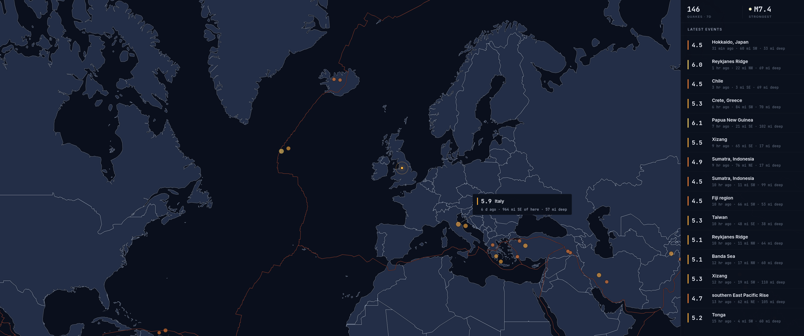
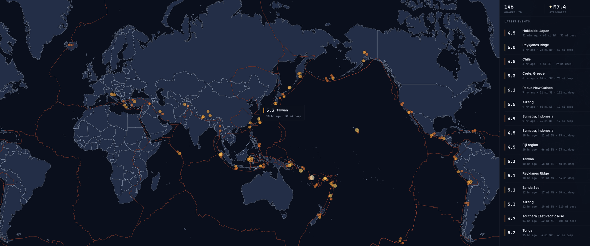

# Seismic Monitor — Screenly Edge App

A live earthquake map for digital signage. It pulls the public **USGS** earthquake
feed (no API key), plots every event on a dark world map sized and coloured by
magnitude, and lists the most recent quakes in a side rail. Built to the Screenly
Edge App spec: `screenly.yml` manifest + `index.html` entrypoint + the injected
`screenly.js` bridge. Fully self-contained — no tile CDN, no JS CDN, no fonts CDN.





## What each file is

- `screenly.yml` — the Edge App manifest: entrypoint, metadata, and the
  user-configurable settings.
- `index.html` — the entrypoint the player loads (`entrypoint.type: file`).
- `static/app.js` — all the logic: reads settings + device metadata off the
  `screenly` bridge, builds the USGS feed URL, fetches through the player's CORS
  proxy, draws the map, and calls `screenly.signalReadyForRendering()` once the
  first frame is ready.
- `static/style.css` — the signage styling (dark, no cursor, scales with the
  screen).
- `static/leaflet.{js,css}` + `static/images/` — Leaflet 1.9.4, vendored.
- `static/world.js` / `static/world.json` — Natural Earth country polygons: the
  built-in offline basemap. The app renders its own dark cartography (land fill,
  cased coastlines) with no network dependency at all.
- `static/plates.js` / `static/plates.json` — tectonic plate boundaries
  (Bird 2003); the quakes visibly trace the plate edges.
- `static/fonts/` — Inter (UI) and JetBrains Mono (numerals), vendored so every
  player renders identical typography.

## Behaviour

- **Map focus** — by default the map centres on the screen's own coordinates
  (from `screenly.metadata.coordinates`) and drops a marker at that spot; set it
  to `world` for the whole-globe frame instead.
- **Point of interest** — a static callout labels the most notable quake on
  screen (scored by strength, recency, and closeness to the screen's location)
  with a leader line to its dot; the pick rotates every 5 minutes.
- **Tsunami strip** — if any event in the window carries the USGS tsunami flag,
  an alarm banner appears with the strongest flagged event.
- **Local testing overrides** — URL parameters beat settings for quick testing:
  `?focus=auto&lat=51.5&lng=-0.13&mag=1.0&window=week&units=km&debug=on`.
  With `focus=auto` and no coordinates at all, the app asks the browser for
  your location (click Allow); on a player the screen's own coordinates always
  win.

## See it running (no player needed)

Open `index.html` in any browser. Off a player there's no `screenly` bridge, so
the app falls back to its defaults and fetches live USGS data directly (USGS
allows cross-origin use).

## Deploy to your screens (Screenly CLI)

```bash
# one-time
screenly login

# from inside this folder — registers the app and writes the id into screenly.yml
screenly edge-app create --name "Seismic Monitor" --in-place

# upload the code + settings
screenly edge-app deploy

# create an instance (a configured copy you can put in a playlist)
screenly edge-app instance create --name "Seismic Monitor"

# optional: override any default at the instance level
screenly edge-app setting set magnitude_threshold=4.5
screenly edge-app setting set time_window=week
screenly edge-app setting set map_focus=auto
```

Then add the resulting asset to a playlist in the usual way — in the web UI, or:

```bash
screenly playlist append <PLAYLIST_UUID> <ASSET_UUID> <DURATION_SECONDS>
```

## Settings

| Setting | Values | Default | Effect |
| --- | --- | --- | --- |
| `magnitude_threshold` | `1.0`, `2.5`, `4.5`, `significant` | `4.5` | Smallest quake plotted. |
| `time_window` | `hour`, `day`, `week`, `month` | `week` | How far back to show. |
| `refresh_minutes` | number | `5` | How often to re-pull USGS. |
| `map_focus` | `auto`, `world` | `auto` | `auto` centres on the screen's own coordinates; `world` shows the whole map. |
| `units` | `miles`, `km` | `miles` | Units for distances and depths in the event list. |
| `debug` | `off`, `on` | `off` | On-screen status/error log for troubleshooting. |

## How it uses the Screenly bridge

- `screenly.settings.*` — the settings above (with fallbacks for browser use).
- `screenly.metadata.coordinates` — to centre the map on the screen's location
  (both the object and array coordinate shapes are supported).
- `screenly.cors_proxy_url` — the USGS request is routed through it on a player;
  it falls back to a direct fetch when the bridge isn't present.
- `screenly.signalReadyForRendering()` — called once the first data render lands
  (`ready_signal` is off, so the player never waits on it).

## Data & attribution

- Earthquake data: **USGS Earthquake Hazards Program** GeoJSON feeds
  (`earthquake.usgs.gov/earthquakes/feed/v1.0/`) — U.S. public domain, no key.
- Basemap: **Natural Earth** vectors, public domain, shipped with the app.
- Plate boundaries: **Bird (2003)**, public domain, shipped with the app.
