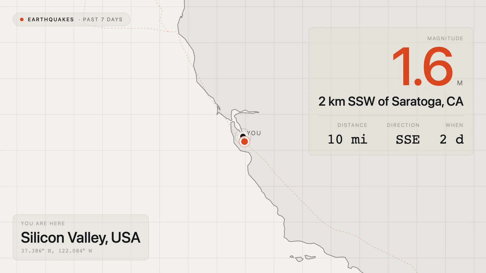

# Earthquakes Near This Screen — Screenly Edge App



A map centred on the screen's own location. The nearest earthquake is called out
— magnitude, place, distance, direction, how long ago — with a dashed line from
the screen to it. One quake, not a scatter of them: nothing else is marked.
Nothing moves and nothing animates; the feed is refetched every five minutes.

The map runs full bleed and the type sits on it in glass panels: the same paper a
shade down, blurred, with a hairline edge, so the coastlines still read through
them. A screen with no location set says exactly that instead of guessing. Set
`override_coordinates` to a latitude and longitude, like `9.9312,76.2673`, to
centre the map somewhere else. The heading then names the nearest city to that
point. Leave it blank and the screen's own position and location are used. `override_locale` changes how the numbers are written (`1.6` or `1,6`).
The labels stay in English.

Data from the public USGS feed, all magnitudes, past 7 days.

## Behaviour when the feed fails

This follows the Edge Apps failure-mode algorithm. There are no credentials —
the USGS feed is public — so the credential half of that diagram does not apply
here. What is left:

| Feed   | `display_errors`   | Result                                  |
| ------ | ------------------ | --------------------------------------- |
| OK     | —                  | Cache the ten nearest, draw the closest |
| Failed | on                 | Show the error, draw nothing            |
| Failed | off, cache present | Draw the last reading received          |
| Failed | off, no cache      | Say it is unavailable                   |

The last row is the diagram's **Abort** terminal. `screenly.signalAbort()` does
not exist yet (Phorge T10903), so for now the app says what happened and signals
ready anyway — an app that never signals stalls the playlist for sixty seconds
and is then dropped with `PlaybackReason::LoadTimeout`.

Only the ten nearest quakes are cached, trimmed to the five fields that get
drawn. That is what the view is sized to, so a cached render is identical to a
live one, and it keeps the cache to about a kilobyte rather than the feed's few
megabytes. Times are absolute, so a stale cache correctly ages its "when". The
cache remembers the position it was nearest to, and is ignored if the screen's
position (or the coordinate override) has changed since.

The feed is given 8 seconds. The screenshotter allows 10 seconds for the page to
go quiet and 10 more for the ready signal, so timing out early leaves room to
fall back to cache, draw, and signal inside the budget.

## How the map works

The map is a flat (equirectangular) world drawn from public-domain Natural Earth
outlines, so placing a point is arithmetic rather than a mapping library:
longitude is a fraction across the view, latitude a fraction down. The view is a
window on it, centred on the screen and sized to hold the ten nearest quakes,
though only the closest is marked — never narrower than about 900 miles across.
It is stretched horizontally by 1/cos(latitude) so distances read correctly, and
the graticule is drawn from the same window.

The whole map — the outlines, the plate boundaries, and the empty paths the
graticule and the distance line are drawn into — is `src/world.svg`, imported as
a raw string and injected at start-up, so `index.html` stays readable.

Every size on the page is a multiple of one unit — a hundredth of the screen's
width, or of its height scaled to 16:9, whichever is smaller — so the layout
fills the screen whatever its shape. This is deliberately not `<auto-scaler>`:
that scales a fixed 1920x1080 design, which would letterbox a portrait screen.
The map window is fitted to the screen's real aspect ratio instead.

The library's stylesheet is deliberately not imported either. It inlines three
Inter faces as base64 — 444 KB of the 458 KB it produces — and this app is
designed on `system-ui` and `ui-monospace` on purpose.

Needs a player: the coordinates, the location name, the units setting and the
CORS proxy all come from the injected `screenly.js` bridge. The bridge hands the
coordinates over as strings — they are converted on the way in, because `+` on a
string silently poisons every sum downstream. A coordinate override is read the
same way, and wins when it is a real latitude and longitude.

## Development

```bash
bun install
bun run dev
```

`dev` starts the CORS proxy alongside the dev server, so the USGS fetch works
locally. Mock screen data is generated into `mock-data.yml` on first run; edit it
to move the screen somewhere else.

```bash
bun run type-check   # also runs automatically before every build
bun run lint
bun run format
bun run test
bun run screenshots  # Playwright captures at each signage resolution
```

### On Windows

`edge-apps-scripts` cannot start on Windows, so `lint`, `type-check`, `build`,
`dev` and `build:dev` all fail with "The system cannot find the path specified".
`resolveBin()` in the library returns `node_modules/.bin/<tool>` with no `.cmd`
or `.exe` extension, and `execSync`/`execFileSync` route that through `cmd.exe`,
which cannot run it. CI is unaffected — it runs on `ubuntu-latest`.

Until that is fixed upstream, call the tools directly:

```bash
node node_modules/typescript/bin/tsc --noEmit --project tsconfig.json
npx eslint --config node_modules/@screenly/edge-apps/eslint.config.ts .
npx prettier --check src/ scripts/ README.md index.html
npx vite build --config node_modules/@screenly/edge-apps/vite.config.ts
```

Those are exactly what the library's own commands shell out to.

`tsc` is invoked through `node` rather than `npx`: with Bun's shim layout npx
cannot find the local one and silently installs `tsc@2.0.4` from the registry,
which is an unrelated package.

## Deploy

Pushing to `development` deploys to stage; pushing to `master` deploys to
production. Both go through `.github/workflows/update-edge-app.yml`, which calls
[Screenly/edge-apps-actions](https://github.com/Screenly/edge-apps-actions)
`update@v26.9.1`. The first create for an environment is the manual
**Initialize Edge App** workflow, `.github/workflows/initialize-edge-app.yml`.

To deploy by hand:

```bash
bun run deploy
```

That builds to `dist/` and deploys from there, so only `index.html`, the
stylesheet and the bundle are uploaded — no source, no `node_modules`, nothing
from the repo root.

## Releases

Tags are `v`-prefixed and incremental (`v0.0.1`, `v0.0.2`). `screenly.yml`
carries the matching `user_version`, which is what the backend reads.

- **GitHub Releases** — the technical record for the tag: fixes, dependency
  updates, refactors. Owned by engineering.
- **CHANGELOG.md** — the user-facing summary, in plain language. This is what
  the marketing site pulls. Owned by marketing.

Both are updated before the tag is applied.
